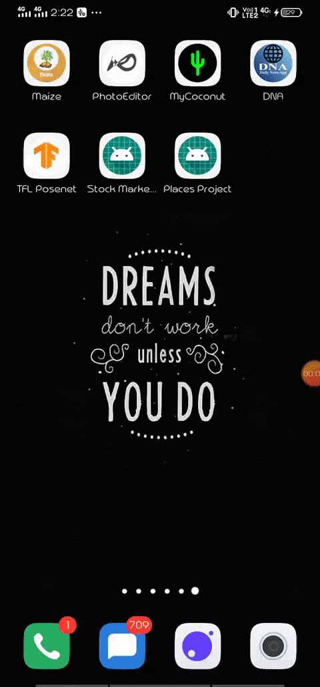
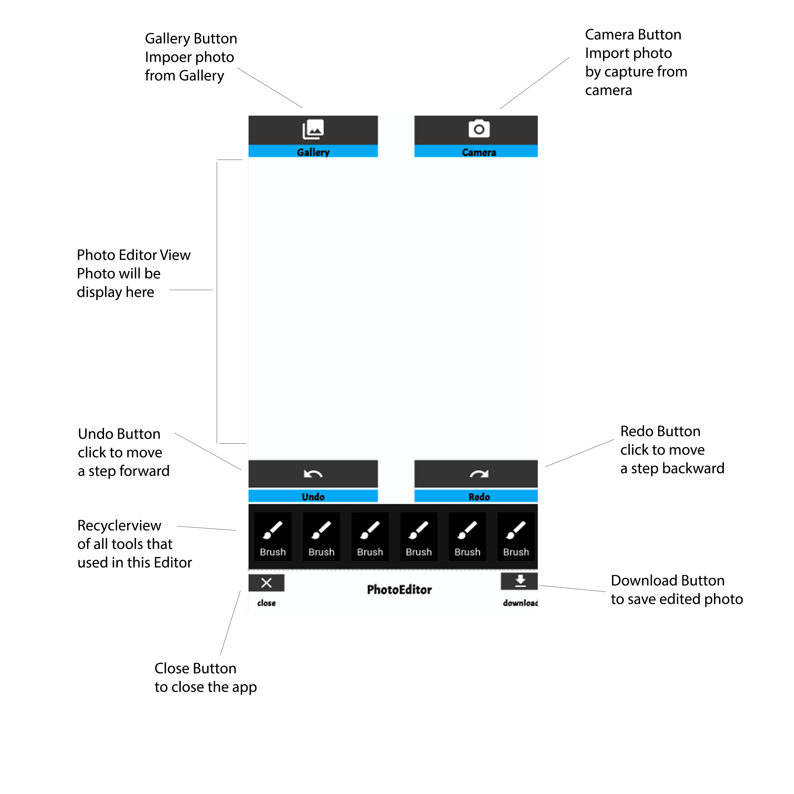

# PhotoEditor
Photo editor with some cool features like filters, text, brush, emoji, strickers etc.
## DEMO

## Getting Started

To start with this, we need to simply add the dependencies in the `build.gradle` file of our app module like this

and we need permissions of Internet and Storage that we need to put on `manifests` file like this

## Setting up the View

First we need to add **Splash screen**, for Splash screen

here after **2.5 sec** we directly move to the next screen

In next screen we use a **swipe button**,whice dependency we already added to the `build.gradle` app file

for the **Swipe Button** in .xml file

and in .java file in we use `.setOnStateChangeListene` to change the state when we swipe the button Left to Right ,

here we use `Intent` object to communicate with next activity

Next screen is our Edit Image screen, where we basically done our editing part.

Below Figure showed what happen in this activity

First need to add First `PhotoEditorView` in the .xml file

## Build a PhotoEditor View

To use the image editing feature we need to build a PhotoEditor which requires a Context and PhotoEditorView 

which we have to already setup in our xml file

here we use `.setPinchTextScalable(true)` property which is uesd for ***set false to disable pinch to zoom on text insertion.By default its true***

## For Drawing

First we need to enable the drawing mode, for that we used a method `mPhotoEditor.setBrushDrawingMode(true);`

To change the Brush Size(px), method used `mPhotoEditor.setBrushSize(brushSize);`

To change the Brush Color, method used `mPhotoEditor.setBrushColor(colorCode);`

To change color Opacity(%), method used `mPhotoEditor.setOpacity(opacity);`

For Brush Eraser, method used `mPhotoEditor.brushEraser();`

## For Filters

We can used inbuild filter to the source images using `mPhotoEditor.setFilterEffect(PhotoFilter.BRIGHTNESS)`;

Or we can used `PhotoFilter` enum from `mPhotoEditor.setFilterEffect(photoFilter);`

## For Text

We can add the text with inputText and colorCode like this

## For Emoji

We can add the Emoji by `PhotoEditor.getEmojis(getActivity())`; which will return a list of emojis unicode `mPhotoEditor.addEmoji(emojiUnicode)`

## For Image/Stickers

We need to add Bitmap to add our Images or stickers `mPhotoEditor.addImage(bitmap)`

## For Undo and Redo

We need to add ` mPhotoEditor.undo()` and `mPhotoEditor.redo()` 

## For Save an Image

We need to add

